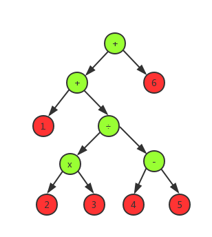
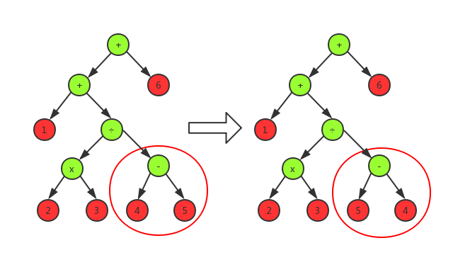
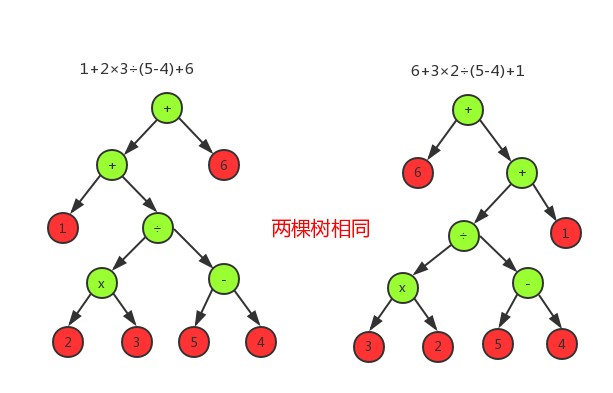

# 四则运算

[GitHub仓库](https://github.com/Pramy/calculate)

## 功能

- [x] 使用 -n 参数控制生成题目的个数
- [x] 使用 -r 参数控制题目中数值的范围, 。**该参数可以设置为1或其他自然数**。
- [x] 生成的题目中计算过程不能产生负数
- [x] 生成的题目中如果存在形如e<sub>1</sub> ÷ e<sub>2</sub>的子表达式，那么**其结果应是真分数**。
- [x] 程序一次运行生成的题目**不能重复**,生成的题目存入执行程序的当前目录下的**Exercises.txt**文件
- [x] 每道题目中出现的运算符个数不超过3个
- [x] 在生成题目的同时，计算出所有题目的答案，并存入执行程序的当前目录下的**Answers.txt**文件
- [x] 程序应能支持一万道题目的生成。
- [x] 程序支持对给定的题目文件和答案文件，判定答案中的对错并进行数量统计

## 设计

### 表达式：

我们平常见到的表达式：**1+2×3÷(4-5)+6**是一种中缀表达式，转化为后缀表达式就是**123×45-÷+6+**，还有一种前缀表达式就详细说了。一条表达式就可以用一颗二叉树来表示，这个种表达式树定义以下性质

- 非叶子节点就是算术符号，叶子节点就是数
- 非叶子节点的左孩子和右孩子非空

无论前缀，中缀，还是后缀，只是访问的时机不一样，上面表达式转化为二叉树就是



绿色为符号节点，红色为数字节点，所以如果限定符号节点数不超过3个，那就是用随机函数，随机生成一个数，在构建一棵子树的时候应该算出子树的**结果**和**树高**

### 负数：

负数的产生是因为减法运算，在上面的算数中4-5会产生负数，在计算符号节点的结果的时候，需要判断一下结果是否是负数，如果是负数，就取绝对，就是将**左右子树互换**就行



表达式**1+2×3÷(4-5)+6**在计算4-5的时候发现是-1，然后对调左右子树，就相当于取了绝对值

### 分数，整数的表示

我的思路就是将整数，也当做分数来计算，然后在输出的时候将分数转化为整数，或者分数的形式，然后定义一个类来表示分数，这个类应该有加减乘除的方法，并且在运算的过程中需要保证最简

### 判断是否重复

递归判断两棵表达式树k<sub>1</sub>，k<sub>2</sub>,  如果**k<sub>1</sub>->left == k<sub>2</sub>->left  && k<sub>1</sub>->right == k<sub>2</sub>->right**，然后就可以判定k<sub>1</sub>，k<sub>2</sub>是两棵相同的树，也就是表达式一样，如果不相同并且符号是＋或者×的时候，就判断**k<sub>1</sub>->left == k<sub>2</sub>->right  && k<sub>1</sub>->right == k<sub>2</sub>->left** ,如果满足，也是相同的一个表达式树，其他都是不相同的树，比如



**1+2×3÷(5-4)+6** 跟 **6+3×2÷(5-4)+1** 就是一样的表达式

## 代码

### 分数：Fraction

定义一个分数类,里面应该需要加减乘除

```java
/**
 * IntelliJ IDEA 18
 * Created by Pramy on 2018/9/16.
 */
public class Fraction {

    /**
     * 分子
     */
    private int a;

    /**
     * 分母
     */
    private int b;

    public Fraction(String string) {
        string = string.trim();

        int a, b;
        int cc = string.indexOf("'");
        int bb = string.indexOf("/");
        if (cc != -1) {

            int c = Integer.valueOf(string.substring(0, cc));
            b = Integer.valueOf(string.substring(bb + 1));
            a = c * b + Integer.valueOf(string.substring(cc + 1, bb));
        } else if (bb != -1) {
            b = Integer.valueOf(string.substring(bb + 1));
            a = Integer.valueOf(string.substring(0, bb));
        } else {
            a = Integer.valueOf(string);
            b = 1;
        }
        adjust(a,b);
    }

    public Fraction(int a, int b) {
        adjust(a,b);
    }

    private void adjust(int a, int b) {
        if (b == 0) {
            throw new RuntimeException("分母不能为0");
        }
        //记录负数的标志
        boolean isNegative = false;
        if ((a < 0 && b > 0) || (a > 0 && b < 0)) {
            isNegative = true;
        }
        a = Math.abs(a);
        b = Math.abs(b);
        int c = gcd(a, b);
        //保证只有a才会小于0
        this.a = isNegative ? -a / c : a / c;
        this.b = b / c;
    }


    /**
     * 加法 a + b
     * @param fraction b 
     * @return a - b
     */
    public Fraction add(Fraction fraction) {
        return new Fraction(this.a * fraction.b + fraction.a * this.b,
                this.b * fraction.b);
    }

    /**
     * 减法 a - b
     * @param fraction b 
     * @return a - b
     */
    public Fraction subtract(Fraction fraction) {
        return new Fraction(this.a * fraction.b - fraction.a * this.b,
                this.b * fraction.b);
    }

    /** 乘法 a x b
     * @param fraction b
     * @return a x b
     */
    public Fraction multiply(Fraction fraction) {
        return new Fraction(this.a * fraction.a,
                this.b * fraction.b);
    }

    /** 除法 a / b
     * @param fraction b
     * @return a / b
     */
    public Fraction divide(Fraction fraction) {
        return new Fraction(this.a * fraction.b, b * fraction.a);
    }

    /**
     * 绝对值
     */
    public void abs() {
        this.a = Math.abs(this.a);
        this.b = Math.abs(this.b);
    }

    /**是否是负数
     * @return a < 0
     */
    public boolean isNegative() {
        return a < 0;
    }

    private int gcd(int a, int b) {
        int mod = a % b;
        return mod == 0 ? b : gcd(b, mod);
    }
}
```

### 表达式：Expression

表达式里面有两个内部类来表示节点

叶子节点是分数节点：Node

```java
static class Node implements Cloneable {
	//表达式结果
    Fraction result;

    Node right;

    Node left;

    int high;
    //```以下省略
}
```

非叶子节点就是符号节点：SymbolNode

```java
static class SymbolNode extends Node {
	//符号	
    String symbol;

}
```

构建表达式

第一种构建方式就是给定非叶子结点的数量，随机生成

```java
    /**
     * 根据符号数来随机构造表达树
     * @param sum 符号数
     * @return node
     */
    private Node build(int sum) {
        //如果是0就构造叶子节点
        if (sum == 0) {
            return new Node(createFraction(bound), null, null, 1);
        }
        ThreadLocalRandom random = ThreadLocalRandom.current();
        //1.否则就是构造符号节点
        final SymbolNode parent = new SymbolNode(null, null, SYMBOLS[random.nextInt(4)]);
        int left = random.nextInt(sum);
        //2.递归下去构造左孩子和右孩子
        parent.left = build(left);
        parent.right = build(sum - left - 1);
        //3.然后计算结果
        Fraction result = calculate(parent.symbol, parent.left.result, parent.right.result);
        //4.如果是负数就取绝对值，然后交换左右孩子
        if (result.isNegative()) {
            Node tmp = parent.left;
            parent.left = parent.right;
            parent.right = tmp;
            result.abs();
        }
        parent.result = result;
        //5.计算树高
        parent.high = Math.max(parent.left.high, parent.right.high) + 1;
        return parent;
    }
```

第二种就是给定特定的中缀表达式来构建

```java
    /** 根据 string 表达式构建树
     * @param expression 表达式
     * @return node
     */
    private Node build(String expression) {
        String[] strings = expression.split(" ");
        Stack<Node> nodeStack = new Stack<>();
        Stack<String> symbolStack = new Stack<>();
        for (String string : strings) {
            //1.如果是数字就构建叶子节点并且进栈
            if (!isSymbol(string)) {
                nodeStack.push(new Node(new Fraction(string), null, null, 1));
            } else {
                //比较符号栈中的顶层符号如果需要出栈
                while (!symbolStack.isEmpty() && !tryPush(string, symbolStack.peek())) {
                    String symbol = symbolStack.pop();

                    if (symbol.equals(LEFT_BRACKETS) && string.equals(RIGHT_BRACKETS)) {
                        break;
                    }
                    push(symbol, nodeStack);

                }
                //如果符号不是")"就进栈
                if (!string.equals(RIGHT_BRACKETS)) {
                    symbolStack.push(string);
                }
            }
        }
        //剩下的符号都推进栈里面
        while (!symbolStack.isEmpty()) {
            push(symbolStack.pop(), nodeStack);
        }
        return nodeStack.pop();
    }

    /**构造一个符号node推入栈
     * @param symbol 符号
     * @param nodeStack 栈
     */
    private void push(String symbol, Stack<Node> nodeStack) {

        if (!symbol.equals(LEFT_BRACKETS)) {
            Node right = nodeStack.pop();
            Node left = nodeStack.pop();
            SymbolNode node = new SymbolNode(right, left, symbol);
            node.result = calculate(symbol, left.result, right.result);
            node.high = Math.max(left.high, right.high) + 1;
            nodeStack.push(node);
        }
    }


    /**
     * 是否可以入栈
     * @param s 准备入栈的复发
     * @param target 栈顶符号元素
     * @return true 能入栈 ，false 不能入栈
     */
    private boolean tryPush(String s, String target) {
        return s.equals(LEFT_BRACKETS) || (isTwo(s) && isOne(target)) ||
                (!s.equals(RIGHT_BRACKETS) && target.equals(LEFT_BRACKETS));
    }

    /**
     * 是否是符号
     * @param s s
     * @return boolean
     */
    private boolean isSymbol(String s) {
        return s.equals(ADD) || s.equals(SUBTRACT) || s.equals(MULTIPLY) || s.equals(DIVIDE)
                || s.equals(LEFT_BRACKETS) || s.equals(RIGHT_BRACKETS);
    }
```

### 功能：Function

输出表达式到**Exercises.txt**和输出答案到**Answers.txt**

```java
    /**
     * @param sum 符号数量
     * @param bound 范围
     */
    public void outputExercises(int sum, int bound) {
        if (bound <= 0 || sum <= 0) {
            throw new RuntimeException("bound or sun must greater than 0");
        }
        Set<Expression> set = new HashSet<>();
        try (BufferedWriter exercisesWriter = new BufferedWriter(new FileWriter("Exercises.txt"));
             BufferedWriter answerWriter = new BufferedWriter(new FileWriter("Answers.txt"))
        ) {
            for (int i = 1; set.size()< sum;) {
                try {
                    //因为在运算的过程中会出现n÷0的情况，这时候就会抛异常
                    Expression expression = new Expression(3, bound);
                    if (!set.contains(expression)) {
                        exercisesWriter.write(i + "." + expression.toString() + "\n");
                        answerWriter.write(i + "." + expression.getResult() + "\n");
                        set.add(expression);
                        i++;
                    }
                } catch (RuntimeException ignored) {

                }

            }
            exercisesWriter.flush();
            answerWriter.flush();
        } catch (IOException e) {
            e.printStackTrace();
        }
    }
```

根据给定的表达式和结果输出正确的题数和错误的题数

```java
    /**
     * 输出结果
     * @param exercisePath 表达式文件路径
     * @param answerPath 结果文件路径
     * @param gradePath 输出结果文件路径
     */
    public void outputGrade(String exercisePath, String answerPath, String gradePath) {
        try (BufferedReader exReader = new BufferedReader(new FileReader(exercisePath));
             BufferedReader anReader = new BufferedReader(new FileReader(answerPath));
             BufferedWriter gradeWriter = new BufferedWriter(new FileWriter(gradePath))
        ) {
            String ex, an;
            int c = 0, w = 0;
            StringBuilder correct = new StringBuilder("Correct: %d (");
            StringBuilder wrong = new StringBuilder("Wrong: %d (");
            while ((ex = exReader.readLine()) != null && (an = anReader.readLine()) != null) {
                int exPoint = ex.indexOf(".");
                int anPoint = an.indexOf(".");
                if (exPoint != -1 && anPoint != -1) {
                    int i = Integer.valueOf(ex.substring(0,exPoint).trim());
                    Expression expression = new Expression(ex.substring(exPoint + 1));
                    Fraction answer = new Fraction(an.substring(anPoint + 1));
                    if (expression.getResult().equals(answer.toString())) {
                        c++;
                        correct.append(" ").append(i);
                        if (c % 20 == 0) {
                            correct.append("\n");
                        }
                    } else {
                        w++;
                        wrong.append(" ").append(i);
                        if (w % 20 == 0) {
                            wrong.append("\n");
                        }
                    }
                }
            }
            gradeWriter.write(String.format(correct.append(" )\n").toString(),c));
            gradeWriter.write(String.format(wrong.append(" )\n").toString(),w));
            gradeWriter.flush();
        } catch (IOException e) {
            e.printStackTrace();
        }
    }
```

## 测试

### 表达式的输出

随机输出10条20范围以内的表达式和答案

```java
private Function function = new Function();

@Test
public void outputExercises() {
    function.outputExercises(10,20);

}
```

得到测试结果:

表达式：

```txt
1.2'13/17 × ( 10 ＋ 11 )
2.16 - 6
3.( 8 - 1'5/9 ) ÷ ( 16 ÷ 5'9/17 )
4.1'5/14 ÷ ( 1/6 × 3 )
5.4'1/9 ÷ 15
6.11 - 6/19 - 4'1/3 ÷ 1
7.9 - 4
8.1 ÷ ( ( 8/19 - 0 ) ÷ 2 )
9.12 - 9 ÷ ( 1'1/15 ＋ 5 )
10.9 ÷ ( 15 - 9 - 11/15 )
```

结果：

```txt
1.58'1/17
2.10
3.2'139/612
4.2'5/7
5.37/135
6.6'20/57
7.5
8.4'3/4
9.10'47/91
10.1'56/79
```

随机输出10000条20范围以内的表达式和答案:

由于太多，给个连接打开

[点击我查看10000条表达式](https://github.com/Pramy/calculate/blob/master/Exercises.txt)

[点击查看答案](https://github.com/Pramy/calculate/blob/master/Exercises.txt)

### 结果的对比

```java
private Function function = new Function();

@Test
public void outputGrade() {
    function.outputGrade("Exercises.txt","Answers.txt","Grade.txt");
}
```

对比上面输出的10条表达式和答案，结果

```txt
Correct: 10 ( 1 2 3 4 5 6 7 8 9 10 )
Wrong: 0 ( )
```

然后故意修改第2道题的结果为100，和第7道题为50，然后再重新运行一遍，结果如下

```txt
Correct: 8 ( 1 3 4 5 6 8 9 10 )
Wrong: 2 ( 2 7 )
```

然后对比10000道题的结果，其中我在答案文件中，随机改变了正确的数值，得到以下对比结果

[点击查看10000道题目的对比结果](https://github.com/Pramy/calculate/blob/master/Grade.txt)

## PSP

| PSP2.1                                  | Personal Software Process Stages        | 预估耗时（分钟） | 实际耗时（分钟） |
| --------------------------------------- | --------------------------------------- | ---------------- | ---------------- |
| Planning                                | 计划                                    | 30               | 60               |
| · Estimate                              | · 估计这个任务需要多少时间              | 30               | 60               |
| Development                             | 开发                                    | 870              | 1415             |
| · Analysis                              | · 需求分析 (包括学习新技术)             | 30               | 60               |
| · Design Spec                           | · 生成设计文档                          | 30               | 150              |
| · Design Review                         | · 设计复审 (和同事审核设计文档)         | 120              | 120              |
| · Coding Standard                       | · 代码规范 (为目前的开发制定合适的规范) | 30               | 20               |
| · Design                                | · 具体设计                              | 30               | 120              |
| · Coding                                | · 具体编码                              | 360              | 1200             |
| · Code Review                           | · 代码复审                              | 30               | 45               |
| · Test                                  | · 测试（自我测试，修改代码，提交修改）  | 240              | 300              |
| Reporting                               | 报告                                    | 80               | 80               |
| · Test Report                           | · 测试报告                              | 20               | 40               |
| · Size Measurement                      | · 计算工作量                            | 30               | 20               |
| · Postmortem & Process Improvement Plan | · 事后总结, 并提出过程改进计划          | 30               | 20               |
| 合计                                    |                                         | 980              | 2155             |

## 总结

与柯文朗同学一起讨论编写程序，我主要负责写代码，然后我们一起讨论，有时候自己卡住的时候，别人的建议会让自己思维变得更加清晰，在写代码的过程中，两个人的思维碰撞会产生意外的结果，有一些细节的地方自己没有办法想到，就可以由另外一个人填补，两个人提高了程序的设计与编写的速度，我们在讨论如果碰到负数的时候应该怎么办的时候，我的想法本来是将减号换为加号，虽然可行，但是在一定程度上干扰了随机生成符号的这设计理念，在我犹豫的过程中，柯文朗同学提出取绝对值得想法，将左右两个表达式互换，最终商讨觉得他的想法比较好，然后采纳了他的想法